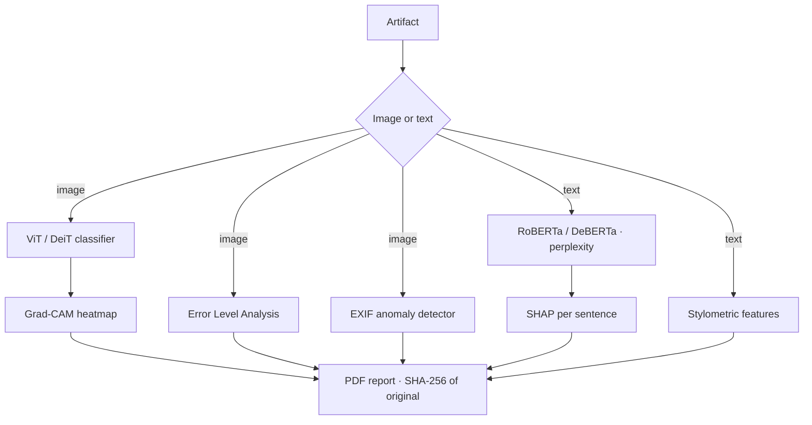

## Problem

Detecting AI-generated content with a single model signature is fragile. ACFS uses two independent approaches — neural classifiers trained on generative artifacts, and low-level physical signal analysis that doesn't rely on model signatures — and is built for evidentiary use: its output is a SHA-256 hashed PDF report.

## Architecture

## What I Built

### Image pipeline

- **Vision Transformer classifiers** (ViT / DeiT) fine-tuned on pixel-level generative artifacts specific to diffusion models and GANs.
- **Error Level Analysis** — re-compresses images at known quality levels and maps regions whose compression artifacts differ from the expected pattern, a signal for compositing or inpainting.
- **EXIF anomaly detection** — flags missing or implausible camera sensor signatures, inconsistent focal-length data, and absent GPS fields.
- **Grad-CAM heatmaps** over the original image showing which regions most influenced the classification.

### Text pipeline

- Fine-tuned **RoBERTa and DeBERTa** models analysing token-level perplexity — generated text tends to be lower-perplexity because generators pick high-probability tokens.
- **Stylometric features**: sentence-length variance, lexical richness, punctuation cadence, POS-tag distribution.
- **SHAP values per sentence**, so a user can see which phrases drove the score.

### Reporting & infrastructure

- FastAPI backend with async inference endpoints for both modalities; Streamlit frontend for analysis without a developer setup.
- PDF forensic report generator that includes a SHA-256 hash of the original artifact.
- DVC for dataset versioning, so retraining is reproducible.
- Docker deployment with GPU passthrough for inference.

## Engineering Decisions

- **Explanations are part of the output.** Grad-CAM for images and SHAP for text mean a score always comes with the evidence behind it.
- **Signals that don't depend on a model.** ELA and EXIF analysis don't rely on having seen a particular generator.

## Technology

Python · PyTorch · HuggingFace Transformers (RoBERTa, DeBERTa, ViT, DeiT) · FastAPI · Streamlit · DVC · Docker · SHAP · Grad-CAM
