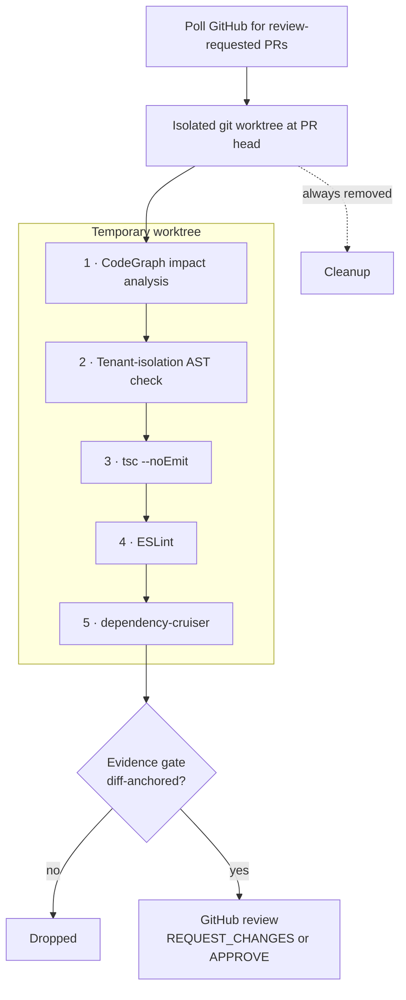

## Problem

A Rust daemon that autonomously reviews pull requests on a production NestJS codebase: it checks each PR out in an isolated git worktree, runs a multi-pass static analysis pipeline, and posts evidence-anchored GitHub review comments — without touching the main branch or waiting for a human to start it.

The central constraint: a reviewer with repository access must not be able to change the repository — and that property is enforced by tests, not by convention.

## Architecture

## What I Built

### Core daemon

- A background Rust process that polls the GitHub API for PRs labelled `review-requested`, filters to those awaiting the bot's review, and processes them in parallel.
- Each PR gets its own `git worktree` at the PR's head commit, separate from the main checkout, so reviews can't contaminate each other or the main branch.

### Five-pass review pipeline

1. **CodeGraph impact analysis** — maps which modules and functions the diff touches and finds downstream callers outside the diff.
2. **AST-level tenant isolation** — verifies every TypeORM repository query in changed files includes an `account_id` scope clause, catching IDOR vulnerabilities before merge.
3. **TypeScript** — `tsc --noEmit` on the worktree, catching type errors the `swc` build pipeline passes silently.
4. **ESLint** — the project's full config, including custom tenant-isolation rules.
5. **dependency-cruiser** — no new dependency violations, such as infrastructure importing from features, or cycles.

### Evidence gate

- A finding becomes a comment only if it has diff-anchored evidence: a specific line in a changed file, not a general pattern match.
- Comments are pinned to exact diff lines through the GitHub Pull Request Review API.
- The bot submits a full review with `REQUEST_CHANGES` or `APPROVE` based on aggregate finding severity.

## Engineering Decisions

### Safety architecture

- `src/github.rs` is architecturally prohibited from containing any `git push`, `git merge` or repository-mutation code path. Unit tests parse the source AST and fail if those patterns appear.
- Worktrees are created in a temp directory and removed after every review, whether the pipeline succeeds or fails.

→ [How I built a PR reviewer that cannot modify the main branch](/writing/pr-reviewer-cannot-modify-main)

## Technology

Rust · Git worktrees · GitHub REST API · GitHub GraphQL API · Antigravity CLI · CodeGraph
