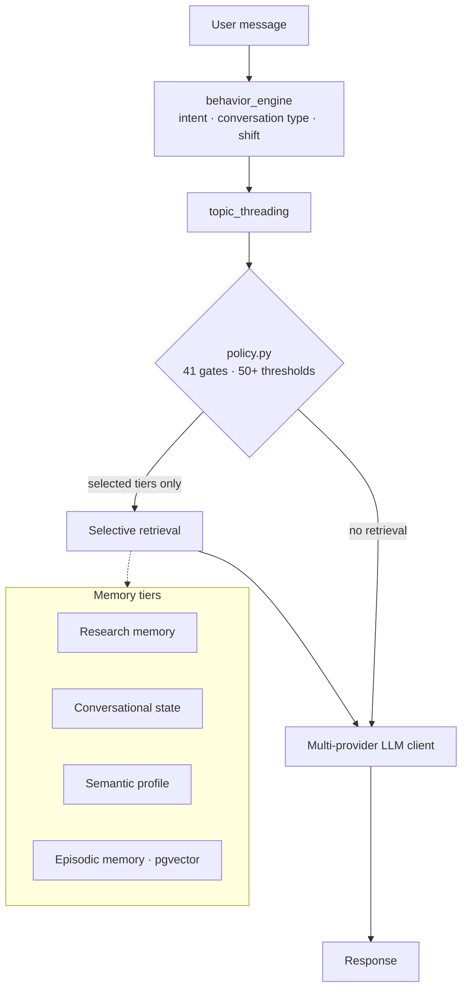

## Problem

A research prototype and reference implementation built around one question: *can a structured, multi-tier memory architecture with deterministic retrieval gating measurably outperform standard sliding-window RAG in multi-turn conversations?*

Production LLM systems tend to hit the same wall: context is a sliding window, "memory" is a buffer, and retrieval is an always-on reflex. BARA replaces that buffer with structured memory and makes retrieval a decision.

## Architecture

### Four memory tiers

| Tier | Scope | Holds |
| --- | --- | --- |
| Research memory | Permanent, cross-thread | Decisions, conclusions and hypotheses extracted from conversation, linked through a concept graph (`research_insights`, `concept_links`) |
| Conversational state | Per conversation | Tone, precision mode, repetition patterns, active topic threads (`conversation_state`, `conversation_threads`) |
| Semantic profile | Permanent, per user | Identity, preferences and expertise domains, refined over time without explicit configuration |
| Episodic memory | Permanent | Past interactions with vector embeddings in pgvector for semantic similarity retrieval |

## What I Built

### Cognitive subsystems

- `behavior_engine.py` — classifies every message for intent, conversation type and behavioural shift *before* any retrieval decision.
- `topic_threading.py` — tracks active topic threads across turns, detecting shifts and threading references back to prior context.
- `research_memory.py` — background extraction of insights, hypotheses and concept links as conversations happen.
- `conversation_state.py` — per-session behavioural state: tone calibration, repetition guard, precision mode.
- `policy.py` — 41 deterministic decision gates with 50+ tunable thresholds controlling exactly when and what gets retrieved.

### LLM orchestration

- Multi-provider LLM client for Cerebras, OpenAI and Anthropic with automatic fallback.
- Intent classification and response generation as separate pipeline stages.
- `profile_detector.py` for passive expertise and preference inference.
- A hook system (`hooks.py`, four hooks) that injects subsystem outputs into the prompt pipeline at the right moment.

## Engineering Decisions

- **Deterministic gates, not a learned router.** Retrieval is controlled by explicit gates with named thresholds, so every decision can be inspected and tuned.
- **Classify before retrieving.** Behaviour classification and topic threading run first; retrieval only sees their output.
- **Make every decision visible.** The React frontend shows a real-time pipeline timeline per request: which gates fired, which memory tier was hit, and what was retrieved.

## Testing / Validation

- **A/B experiment framework** comparing BARA against standard RAG over a 5,000+ chunk knowledge base: 52 complete IETF RFCs plus 14 technical documents.
- **50-query evaluation suite** with LLM-as-a-Judge relevance scoring.
- **358 automated tests** covering each subsystem independently.
- `cli.py` for inspecting and querying cognitive state between sessions.

<!-- Results: add measured A/B outcomes here once they are published in the repository. -->

## Technology

Python 3.12 · FastAPI 0.115+ · PostgreSQL · pgvector · numpy · React · Vite · Tailwind · Vercel AI SDK · Zustand · Docker
