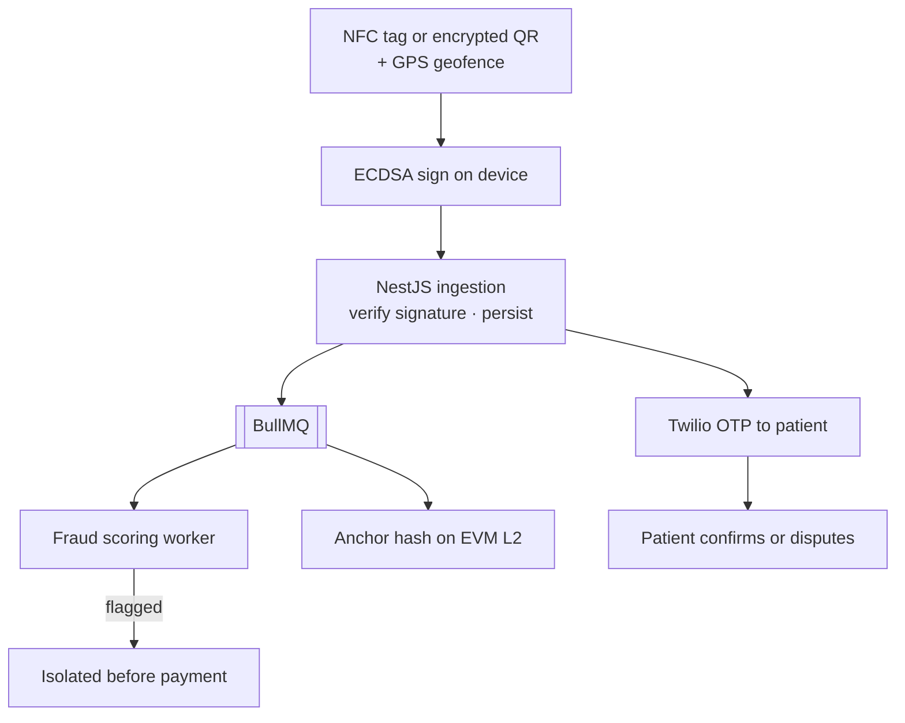

## Problem

Community health workers in remote regions report visits on paper or simple apps. That invites "ghost visits" — fake check-ins, inflated visit counts, ghost beneficiaries — and traditional databases allow retroactive edits, so a single compromised credential can alter the entire audit trail.

DHVVS replaces those records with cryptographic proof of physical presence, on-device signing, and blockchain anchoring. It is a Turborepo monorepo with four applications.

## Architecture

## What I Built

### The proof chain

1. **Hardware presence proof** — an NFC tag handshake or encrypted local QR at the patient's doorstep confirms physical proximity; GPS geofencing adds a second spatial assertion.
2. **On-device cryptography** — the visit payload is ECDSA-signed on the health worker's device using secure-enclave keys before any network call, establishing non-repudiation at the point of care.
3. **Backend ingestion** — a NestJS API with Prisma on Neon serverless PostgreSQL verifies signatures and persists the record; BullMQ dispatches fraud scoring and anchoring as async jobs.
4. **Asynchronous fraud engine** — workers score each visit for impossible travel velocity between consecutive visits, overlapping time windows, anomalous durations, and GPS clustering that suggests stationary reporting. Flagged visits are isolated before payment processing.
5. **Blockchain anchoring** — a Solidity contract on an EVM Layer-2 receives a hash of the verified record (CHW ID, patient ID, timestamp, GPS coordinates, signature). Once on-chain, no database admin can retroactively alter it.
6. **Patient feedback loop** — Twilio sends the patient an OTP after each visit; they confirm or dispute it through a minimal web form.

### Four applications

- `apps/mobile-app` — React Native + Expo: NFC scanning, offline-first capture with a local queue, sync on reconnect.
- `apps/backend` — NestJS 10 + Prisma + Neon: ingestion, fraud-scoring queue, blockchain dispatch, JWT + ECDSA auth.
- `apps/admin-dashboard` — React 18 + Vite + Material UI + Recharts + Leaflet: visit monitoring, fraud alerts, geospatial heatmaps.
- `apps/patient-portal` — a minimal React form for OTP confirmation.

## Engineering Decisions

- **Sign before the network.** Signing on the device means the backend verifies a claim rather than creating one.
- **Keep the slow parts async.** Fraud scoring and on-chain anchoring run as queued jobs, off the ingestion path.
- **Anchor a hash, not the record.** The chain stores a hash of the verified visit; the relational record stays in Postgres.

## Technology

NestJS 10 · TypeScript 5 · Prisma · Neon PostgreSQL · React Native 0.73 · Expo SDK 50 · React 18 · Solidity 0.8.24 · Hardhat 2.19 · Ethers.js v6 · BullMQ · Redis · Twilio · Turborepo · Docker
