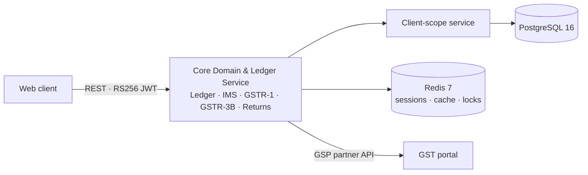
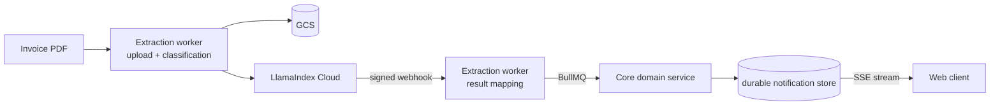
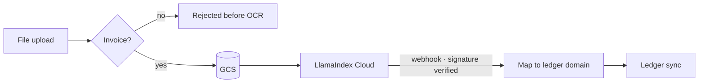

## Overview

The platform is a full-stack FinTech SaaS product built from the ground up for accounting firms and businesses to file Indian GST returns, manage invoices and purchase ledgers, reconcile data with the government's GST portal, and extract invoice data from PDFs using AI-powered OCR.

I was a primary contributor from the start of the project across both backend services: the **Core Domain & Ledger Service** and the **Document Extraction & Ingestion Worker**.

## Architecture

The system is two services: the Core Domain & Ledger Service owns the domain (ledgers, IMS, returns, notifications) and the Document Extraction & Ingestion Worker owns document intake and extraction. Long-running work — extraction results, M9 reconciliation — crosses the boundary through BullMQ and reaches the browser over a single durable SSE stream.

**Request path.** Every tenant-facing query goes through one scoping service before it reaches the database.

**Async path.** Extraction starts in the ingestion worker and ends as a notification on the client's stream.

Business services never touch the ORM or Redis directly: the codebase was migrated to a layered structure — features, models, infrastructure, shared and core layers — with the Repository Pattern enforced between them.

## Core Systems

### Foundation

- **Project bootstrapping & auth.** Set up the NestJS project from scratch: Husky pre-commit hooks, branch protection, lint-staged, architecture linting. Implemented RS256 JWT authentication with Redis-backed session management, bcrypt password hashing, OTP-based login, concurrent session limits, and a Swagger-documented auth module.
- **Layered architecture migration.** Moved the codebase to feature, model, infrastructure, shared and core layers; decoupled monolithic utility files into domain-isolated modules.
- **Redis caching strategy.** A structured `ioredis` caching layer so JWT validation, GST lookups and session handling stop repeating database queries.
- **Signup with Redis staging.** Signup no longer writes to the database until email verification completes — pending accounts live in Redis with a 30-minute TTL, so unverified accounts never bloat the tables.

### Ledger & invoices

- **Atomic invoice ledger REST endpoints** — books, invoice lists, invoice detail and update, and line items, with India-specific GST math: CGST/SGST vs IGST depending on intra- or inter-state supply. All monetary calculations moved to `Decimal.js` to eliminate floating-point error on tax totals.
- **Line-item atomicity** — deletion goes through the invoice aggregate root as part of the invoice update. The separate delete endpoint was removed so multi-part edits are atomic and header totals are never recomputed against an intermediate state.
- **Signed GCS file URLs** — invoice responses carry a signed Google Cloud Storage URL for the original PDF, so a CA can check a draft under review against the actual bill.
- **HSN/SAC rate mapping** — parsed government GST master data to add GST rates to the HSN/SAC lookup, letting the frontend auto-populate line-item tax rates.

Smaller ledger fixes

- **Books ledger** — clients with zero invoices were dropped from the Books ledger because of an `INNER JOIN` on the invoice table. A `LEFT JOIN` with conditional filters keeps every active client visible.
- **Sorting** — sort field and direction on invoice lists in both Ledger and IMS, restricted to the columns the UI actually renders.

## GST / Returns

### Invoice Management System (IMS)

I built the IMS module from scratch against the government-authorized GST portal through a GSP partner API: automated sync of inward (supplier) invoices, reconciliation against the local purchase ledger with an auto-match engine, and bulk accept/reject actions for CA firms. The Supplier View (SUPVIEW) integration fetches supplier-uploaded invoices and surfaces them alongside IMS data.

IMS details

- **ITC reduction flow** — the portal's ITC-reduction question wired end-to-end: partial reductions, bill-of-entry actions, partial-success recovery, and save-schema validation that the platform had previously left to the portal to enforce.
- **Dashboard metrics** — the summary returns accepted, rejected, pending and no-action counts using a database-side `CASE` aggregation.
- **Orphan status** — B2B invoices that can't be auto-matched to a local purchase invoice move out of the review queue into their own status. Party-name resolution became a single bulk lookup per page.
- **Supplier reconciliation diff & comparison service** — lets the frontend look up match data starting from the internal purchase invoice rather than the IMS record.

### GSTR-3B & GSTR-1 filing

- **Filing state machine** — the full lifecycle: draft creation, portal sync, GSTN submission. Separate draft and filed GSTR-3B records were unified into a single canonical row per account, GSTIN and period, with transactional, zero-data-loss migration scripts.
- **Rule 88A enforcement** — Table 6.1 is pinned to the GSTN `RETFILE` payload, recording exact ITC provenance (`pditc` values) so the legal tax set-off order is enforced structurally. Reverse Charge Mechanism liability can no longer be offset with ITC balances.
- **Every tile editable** — a CA can hand-correct any GSTR-3B tile at the last minute without re-triggering a full GSTR-1 regenerate.

Tax correctness fixes

- Table 4A(5) and 4A(3) were double-counting: the sum included every GSTR-2B section, including import credit and ISD credit already counted elsewhere. The sum is now constrained to `b2b`, `cdnr` and `ecom`.
- Table 3.1(b) was being treated as tax-free even though exporters ship with payment of IGST.

### GSTR-2B storage and M9 reconciliation

GSTR-2B used to be stored as a fresh snapshot per sync — unbounded growth, and no stable identity per invoice. I refactored it to an upserted header plus per-invoice rows keyed on natural keys. That change is what made the **M9 three-way reconciliation** possible: it matches the purchase register against IMS and GSTR-2B for a GSTIN and period and classifies every document as an exact match, a mismatch, missing in 2B, missing in books, or drift. It runs as a queued job and delivers its result over SSE.

### Returns read model

GST return status queries are served from a precomputed returns status projection. Query latency dropped from 3,000ms+ to sub-15ms at peak load. The projection stays fresh through source-changed domain events emitted by the GSTR-1 and GSTR-3B writers. → [Write-up](/writing/gst-returns-read-model)

## Document AI

The extraction pipeline lives in the Document Extraction & Ingestion Worker:

- **Invoice vs non-invoice guard** — LLM-based classification at upload time rejects non-invoice PDFs before they reach the expensive OCR pipeline.
- **OCR accuracy fixes (F1–F14)** — resolved 14 forensic audit findings: mapping errors on multi-currency invoices, split-tax line items, discount/freight amounts, and item-name mismatches.
- **HSN validation & prompt engineering** — extracted items are validated against the tax master tables, and the extraction prompt was reworked for field accuracy.
- **Storage path provenance** — the extraction write path persists the original file's storage path on the created invoice so the API can serve a signed download URL to the reviewer.
- **Redis session namespacing** — the worker's session keys now follow the same environment-namespaced convention as the core service, fixing auth misses in shared Redis instances.

## Real-Time Infrastructure

Several ephemeral SSE channels were replaced by one **durable notification centre**: a database-backed store covering invoice extraction, IMS, GSTR-1 and credit-ledger workflows.

- A single notification stream sends 25-second heartbeats, replays missed events on reconnect via `Last-Event-ID`, and correlates every async workflow with a run ID.
- **Redis keyspace P0.** The extraction worker produced BullMQ jobs to the bare `bull:` default keyspace while the core service consumed from an environment-namespaced prefix. Same queue name, different keyspace — every OCR extraction result was enqueued where nothing would ever read it. → [Write-up](/writing/redis-bullmq-namespace-bug)

## Security & Multi-Tenancy

- **Multi-tenant ABAC core** — attribute-based access control at the foundation: enterprise accounts (CA firms managing many clients) vs individual accounts (businesses managing their own GST), with staff–client mapping enforced on every route by a client-access guard.
- **Centralised tenant scoping** — tenant isolation consolidated from 19 scattered ad-hoc filters into one client-scope service, plus a custom ESLint rule in CI that blocks unscoped repository queries from merging.
- **IDOR test matrix** — cross-tenant access attempts across every ledger and invoice mutation route.

Auth hardening

- **OTP race condition** — concurrent OTP verify calls are serialised with a Redis lock to prevent double redemption.
- **Secure staff invites** — owner-typed staff passwords replaced by a single-use email invite link with expiry and auto-login.
- **Rate limiting** — NestJS `@Throttle` limits on token refresh (20/min) and password-reset validation.
- **User status lifecycle** — active, inactive, suspended and invited states, with suspended users blocked at the JWT strategy layer across all endpoints.

## Performance

- **Returns queries** — 3,000ms+ to sub-15ms at peak load by serving them from a precomputed projection kept fresh by domain events.
- **JWT cold path** — on a Redis cache miss, two sequential DB calls became one `LEFT JOIN` query.
- **IMS party names** — resolved in a single bulk lookup per page.
- **E2E suite** — Testcontainer boots reduced from 26 to 1 shared instance.

## Engineering Quality

- **CI/CD** — GitHub Actions deployment consolidated into one branch-aware workflow for the dev and UAT GCP VMs, with Slack Block Kit notifications (start / success / failure, timing, commit links).
- **Tests** — 3,668 unit tests and 434 E2E tests maintained; Allure reports capture full HTTP request/response payloads on failure.
- **Static analysis gates** — `knip`, `dependency-cruiser` and `jscpd` as blocking PR checks. CI now runs `tsc`: the `swc` builder ran with `typeCheck: false`, so type errors were only caught by a Husky hook that `--no-verify` bypasses.
- **Schema squash** — 46 SQL migration files consolidated into one canonical schema file; the Repository Pattern enforced across account, email, IMS and ledger modules.
- **Dependency vulnerabilities** — 34 down to 0 using targeted `overrides` for deep transitive tooling dependencies.

Documentation

- **Architecture vault** — an internal knowledge vault of 101 interconnected Markdown notes covering domain invariants, ADRs and system boundaries, with a machine-readable context resolver for AI coding agents.
- **GST portal API reference** — an in-repo reference for the 273-endpoint GST Developer Portal Returns module: 15 pages covering every return type, error codes, and request/response payloads.

## Technology

NestJS 11 · TypeScript 5 · Node.js 24 LTS · PostgreSQL 16 · TypeORM · BullMQ · Redis 7 · Google Cloud Storage · LlamaIndex Cloud · Passport JWT (RS256) · Server-Sent Events · Decimal.js · Jest · Testcontainers · Allure · Docker · GCP
