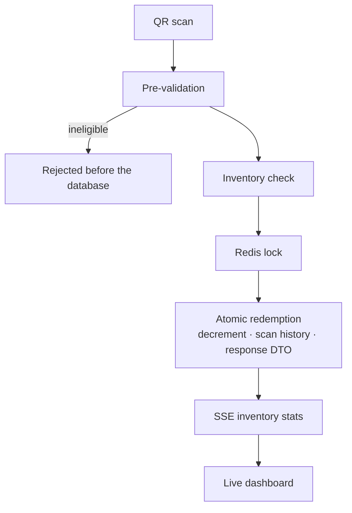

## Problem

The platform lets businesses create and run dynamic QR code campaigns with sponsor ad delivery, real-time scanning, redemption tracking, video content and live dashboards. The scan path is where correctness matters most: many people can scan against the same limited inventory at the same moment, and a redemption must never be granted twice for one unit.

I was the primary backend engineer on the platform.

## Architecture

## What I Built

### QR generation & scanning

- **Scan path with pre-validation.** Pre-checks run before hitting the database to reduce load at scale; inventory updates are atomic, using Redis-level locking to prevent double redemptions under concurrent scans.
- **Redemption flow.** Eligibility validation, inventory decrement, scan-history recording, and structured redemption response DTOs for the mobile client.
- **Live inventory.** Real-time stats for line and redemption QR codes, streamed to dashboards over SSE.
- **QR generation.** Logo embedding, redemption QR PDF downloads with dynamic sizing, and Japanese/multilingual text on generated PDFs.

### Campaign lifecycle & status engine

- Campaign and campaign-line repositories with full CRUD and lifecycle transitions (draft → live → completed → inactive), including the `LIVE → INACTIVE` path and timestamp management.
- Timezone-aware campaign validation and auto-join for live campaigns, so campaigns activate and expire correctly across regions.
- A campaign progress service returning a user's active and historical campaigns ordered by most recent scan.
- Campaign video URL and type support (YouTube vs MP4), validated in both repository and service layers.

### Sponsor ad system

- Admin CRUD for sponsor ads, plus mobile-side injection into explore and campaign-detail responses.
- Server-side UTM redirect with prebuilt UTM parameters, a click-tracking endpoint and ad metrics retrieval — no DB call on the redirect path.

## Engineering Decisions

- **Filter archived data at the query layer.** Archived campaign lines are excluded in the query, not the service, so deleted data is never instantiated as ORM entities or returned to any client.
- **Direct injection over strategy pattern.** Ad placement was refactored from a strategy-pattern approach to direct injection into the response pipeline.
- **Keep the redirect path free of the database.** UTM parameters are prebuilt, so the redirect itself does no lookup.

## Testing / Validation

- Unit tests across all modules to reach 90%+ statement coverage.
- CI coverage workflow rebuilt with concurrency settings, `node_modules` caching, and per-module test result reporting.

Other features

- **Analytics.** The analytics service and campaign date caching moved to Elasticsearch keyword fields with timezone normalisation and better error handling; campaign activation timestamps and date formats corrected across the pipeline.
- **Email queue.** Async campaign-completion emails through BullMQ and Redis, with graceful fallback handling.
- **Feedback** for campaign participants.
- **Vendor bulk upload** with a simplified template and ISO-only country codes.

## Technology

NestJS 10 · TypeScript 5 · MySQL 8.0 · TypeORM · BullMQ · Redis · Elasticsearch · JWT · Jest · Docker
