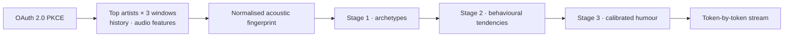

## Problem

SonicMirror connects to a Spotify account, pulls acoustic signal data from listening history, and runs it through a multi-stage Gemini pipeline to generate a personality profile grounded in that data. The hard part is keeping a language model from answering with generic statements.

## Architecture

## What I Built

### Spotify data pipeline

- Full **OAuth 2.0 PKCE** flow with token refresh and no backend credential storage.
- Top artists across three time windows (short-term, medium-term, all-time), listening history, and per-track audio features: valence, energy, tempo, danceability, acousticness, instrumentalness, loudness, speechiness.
- Features aggregated across top tracks into a normalised acoustic fingerprint.

### Gemini prompt pipeline

- **Stage 1** maps the fingerprint to personality archetypes using psychoacoustic correlations (for example, high valence with high energy as an extroversion signal; high acousticness with low tempo as an introspection signal).
- **Stage 2** infers behavioural tendencies and decision-making patterns.
- **Stage 3** generates humour calibrated to the profile.

### Frontend

- Next.js 15 App Router with React 19: server components for the initial OAuth redirect, client components for the streamed profile.
- Gemini output rendered token by token as it generates.
- Glassmorphic UI whose animated gradient background shifts with the user's dominant valence score.

## Engineering Decisions

- **Forbid the generic answer.** The prompts explicitly prevent outputs like "you enjoy music" and force specific, falsifiable claims tied to the numeric signal data.

## Technology

Next.js 15 · React 19 · TypeScript · Spotify Web API · Google Gemini · Tailwind CSS · Vercel
