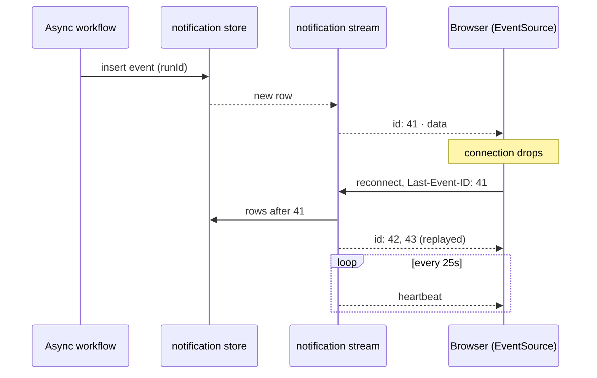

Much of what a GST compliance platform does for a user takes longer than a request. Invoice extraction goes out to LlamaIndex Cloud and comes back through a webhook. IMS syncs talk to the GST portal. GSTR-1 generation and credit-ledger workflows run in the background. M9 reconciliation — a three-way match of the purchase register against IMS and GSTR-2B — is queued and runs asynchronously.

All of those need to tell the browser when they finish. This is about how that channel changed.

## The problem

Updates originally went out over **multiple ephemeral SSE channels**: events existed only while they were being sent.

Ephemeral streams have one weakness that matters here: if nobody is connected when the event is sent, the event is gone. Browsers disconnect all the time — a laptop lid closes, a network changes, a proxy drops an idle connection, a user opens a second tab. With a workflow that takes a while, the chance that the client is connected at exactly the moment it completes is lower than it looks.

## Why SSE, and why durable

Server-Sent Events fit the direction of traffic: the server has news, the client listens. They run over plain HTTP, and the browser's `EventSource` reconnects on its own and resends the last event ID it saw in a `Last-Event-ID` header.

That last property only helps if the server can answer the question it implies: *what did I miss since this ID?* An ephemeral channel can't. A stored one can.

## The architecture

The channels were replaced with one **durable notification centre**: a database-backed store covering invoice extraction, IMS, GSTR-1 and credit-ledger workflows, served through a single endpoint.



The stream endpoint does three jobs:

- **Heartbeats every 25 seconds**, so an idle stream still carries traffic and intermediaries don't treat it as dead.
- **Replay on reconnect** via `Last-Event-ID`: events after the client's last seen ID are sent before live ones.
- **Run-ID correlation** across every async workflow, so the client can match a notification to the action that started it — including after a reconnect, or in a different tab.

The endpoint's shape, as a simplified NestJS sketch:

```ts title="notifications.controller.sketch.ts" {32-34}
import { Controller, Headers, MessageEvent, Req, Sse } from '@nestjs/common';
import { concat, interval, map, merge, Observable } from 'rxjs';

interface NotificationRow {
  id: number;
  runId: string;
  type: string;
  payload: unknown;
}

interface NotificationStore {
  after(userId: string, lastId: number): Observable<NotificationRow>;
  live(userId: string): Observable<NotificationRow>;
}

const toEvent = (row: NotificationRow): MessageEvent => ({
  id: String(row.id),
  type: row.type,
  data: { runId: row.runId, payload: row.payload },
});

@Controller('events')
export class NotificationsController {
  constructor(private readonly store: NotificationStore) {}

  @Sse('stream')
  stream(
    @Req() req: { user: { id: string } },
    @Headers('last-event-id') lastEventId?: string,
  ): Observable<MessageEvent> {
    const userId = req.user.id;
    const missed = this.store.after(userId, Number(lastEventId ?? 0));
    const heartbeat = interval(25_000).pipe(map(() => ({ type: 'heartbeat', data: '' })));
    return merge(concat(missed, this.store.live(userId)).pipe(map(toEvent)), heartbeat);
  }
}
```

*A sketch, not the production controller. The durable part is the `after()` query: replay reads from the same table the workflows write to.*

## Trade-offs

- **Storage and cleanup.** Durable events are rows; they need retention rules, or the table grows forever.
- **Ordering is by the store's ID.** Replay correctness depends on IDs increasing in insertion order for a user. A table with a monotonically increasing key gives that for free; an in-memory channel does not.
- **One stream, many producers.** Consolidating channels means every workflow writes the same notification shape. That's a constraint on new workflows — and also the point.

## Where it's used

The same stream carries the result of the M9 reconciliation engine: it is queued, runs asynchronously, and delivers its classification — `EXACT`, `MISMATCH`, `MISSING_IN_2B`, `MISSING_IN_BOOKS`, `DRIFT` — over SSE when it completes. It is also the end of the invoice extraction pipeline: once an OCR result arrives through BullMQ and is mapped into the ledger, the notification is what tells the reviewer it is ready.

## What it taught

Real-time delivery is easy to demo and hard to make reliable, because demos don't disconnect. Once events are stored, "real-time" becomes an optimisation on top of something that is already correct: the client gets the update now if it's listening, and on reconnect if it wasn't.
