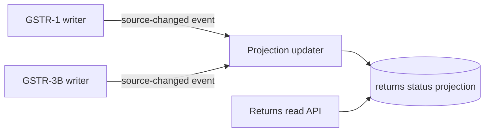

import ReadModelExplainer from '../../apps/web/src/components/explainers/ReadModelExplainer.astro';


The platform is a GST compliance product for Indian accounting firms and businesses. One of its busiest screens is the returns dashboard: for a client's GSTIN and a tax period, where does each return stand? That screen is served by a returns read API, and at peak load it took more than 3,000ms to answer.

After the change described here, the same endpoint answers in under 15ms at peak load. Those two figures are the only measurements in this article. The rest is about why the fix had the shape it did.

## The problem

A returns dashboard looks like a read. It is really a summary of several write-heavy systems. Here, the state behind it comes from separate modules with their own lifecycles:

- **GSTR-1** — outward supplies, with draft creation, portal sync and GSTN submission.
- **GSTR-3B** — the monthly summary return, itself a state machine, stored as one canonical row per `(account, GSTIN, period)`.

When status has to be assembled from those sources at the moment someone opens the dashboard, the cost of every read grows with the cost of the sources. And it grows with load: at peak, the endpoint was taking over 3,000ms.

## Why a cache wasn't the answer

The quick fix for a slow read is to cache the response. That trades latency for staleness, and a returns dashboard is exactly where staleness hurts: a CA who has just filed a GSTR-3B needs to see it as filed, not as it was a TTL ago.

A cache is also keyed by *requests*. The thing that changes is *filings*. Invalidating a response cache correctly means knowing every request whose answer a filing touched — the same derivation work, moved somewhere harder to test.

## The architecture

The fix inverts the direction: instead of the reader asking every source for its state, **the sources tell a projection when they change**.

<ReadModelExplainer />



Three parts:

1. **A projection table** holding the status the dashboard needs, already computed.
2. **A source-changed domain event**, emitted by the GSTR-1 and GSTR-3B writers whenever they change something the dashboard depends on.
3. **A thin read path.** The returns read API selects from the projection. It no longer knows how status is derived.

The shape of the updater, as a simplified sketch — all names here are illustrative:

```ts title="returns-projection.sketch.ts"
type ReturnsSourceChanged = {
  type: 'returns.changed';
  accountId: string;
  gstin: string;
  period: string; // e.g. "2026-08"
};

interface ReturnStatusRow {
  accountId: string;
  gstin: string;
  period: string;
  gstr1Status: string;
  gstr3bStatus: string;
  updatedAt: Date;
}

interface ReturnSources {
  gstr1Status(gstin: string, period: string): Promise<string>;
  gstr3bStatus(gstin: string, period: string): Promise<string>;
}

interface ProjectionStore {
  upsert(row: ReturnStatusRow): Promise<void>; // keyed on (accountId, gstin, period)
}

export async function onReturnsSourceChanged(
  event: ReturnsSourceChanged,
  sources: ReturnSources,
  projection: ProjectionStore,
) {
  // Recompute one row from the sources of truth. Handling the same event
  // twice is harmless: the row converges to the same value.
  const [gstr1Status, gstr3bStatus] = await Promise.all([
    sources.gstr1Status(event.gstin, event.period),
    sources.gstr3bStatus(event.gstin, event.period),
  ]);
  await projection.upsert({ ...event, gstr1Status, gstr3bStatus, updatedAt: new Date() });
}
```

Two properties are worth designing in from the start, whatever the implementation:

- **Recompute, don't increment.** The handler derives the row from the sources rather than applying a delta, so a duplicated or reordered event can't corrupt it.
- **Scope the work to one key.** An event names the account, GSTIN and period it affects. The cost of keeping the projection fresh is paid per change, not per read.

## What it costs

A read model is not free. It moves cost and risk rather than deleting them:

- **The event is now a contract.** Any code that changes return state and doesn't emit the source-changed event makes the dashboard wrong, silently. Today the GSTR-1 and GSTR-3B writers emit it; a new writer has to as well.
- **Freshness becomes a window.** Between a write and its projection update there is a gap. For a status dashboard that is acceptable if the gap is short and bounded. Anything that needs exact state to make a decision should read the source of truth, not the projection.
- **You need a way to rebuild.** If the projection ever drifts, recomputing it from the sources has to be possible. The recompute-not-increment handler makes that the same code path.

## What was measured

Query latency for returns status dropped from **3,000ms+ to sub-15ms at peak load**.

## What it taught

The slow part of a summary screen is rarely the query you're looking at. It's that the screen is asking questions whose answers only change when something is written. Once the writers announce their changes, the question can be answered ahead of time — and the endpoint that used to be the hardest to make fast becomes one of the simplest in the codebase.
