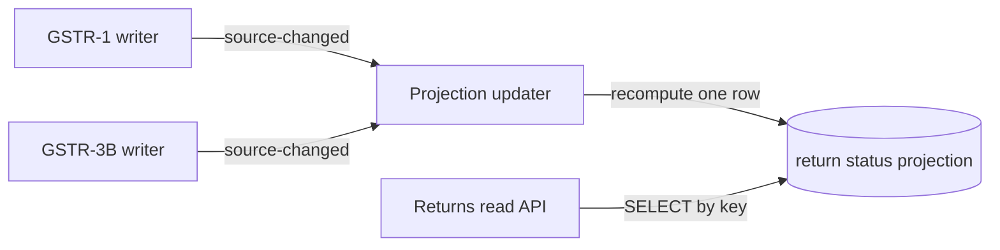

import ReadModelExplainer from '../../apps/web/src/components/explainers/ReadModelExplainer.astro';

The returns dashboard answers one question for a CA firm: for each client GSTIN and each tax period, where does every return stand? At peak load, the API behind it took **more than 3,000ms** to answer. After the change described here it answers in **under 15ms** at peak. Those are the only two measurements in this document; everything else is the reasoning behind the design.

> SQL and TypeScript here are written for this post and simplified (table and event names included). They follow the design as built; they are not the employer's source.

## Context

Return status isn't stored anywhere as such. It is a summary of write-heavy modules with their own lifecycles:

- **GSTR-1** — outward supplies: draft creation, portal sync, GSTN submission.
- **GSTR-3B** — the monthly summary return, a state machine of its own, which CAs can also hand-correct tile by tile late in the cycle.

The read path derived status from those sources on every request. So the cost of a dashboard read was the cost of asking each source, for each client and period on screen — and it grew with exactly the load that peaks near filing deadlines.

## Requirements

1. **Freshness after a filing.** A CA who has just filed a GSTR-3B must see it as filed on the next refresh. On a screen people act on, a status that lags by a TTL is worse than a slow one.
2. **Read cost independent of source cost.** The dashboard should not get slower because GSTR-1 or GSTR-3B got more complex.
3. **Correctness under retries and reordering.** Whatever keeps the status up to date must tolerate the same change being announced twice, or two changes arriving out of order.
4. **Rebuildable.** If the stored status is ever wrong, recomputing it from the sources must be possible without special tooling.

## Options

| Option | Freshness | Read cost | Why not / why |
| --- | --- | --- | --- |
| Cache the API response (TTL) | Stale for up to a TTL after filing | Low on hit, full on miss | Fails requirement 1. Invalidation is keyed by *requests*, but what changes is *filings*; correct invalidation needs to know every request a filing affects — the derivation, moved somewhere harder to test. |
| Materialised view, refreshed on a schedule | Stale until next refresh | Low | Same staleness problem, and a full refresh recomputes every row to change one. |
| **Projection updated by domain events** | Fresh within one event's handling | One indexed row per key | Chosen. Writers announce changes; one row per `(account, GSTIN, period)` is recomputed. |

The chosen design inverts the direction of the work: instead of the reader asking every source for its state, **the sources tell a projection when they change**.

<ReadModelExplainer />

## Design



### Data model

One row per client GSTIN and period, holding exactly what the dashboard renders:

```sql title="return-status.sql"
CREATE TABLE return_status (
  account_id     uuid        NOT NULL,
  gstin          char(15)    NOT NULL,
  period         char(6)     NOT NULL,          -- MMYYYY, as the portal uses it
  gstr1_status   text        NOT NULL,
  gstr3b_status  text        NOT NULL,
  updated_at     timestamptz NOT NULL DEFAULT now(),
  PRIMARY KEY (account_id, gstin, period)
);

-- The dashboard's query: one account, a set of periods.
CREATE INDEX return_status_account_period ON return_status (account_id, period);
```

The read API becomes a single indexed `SELECT` scoped to the tenant. It no longer knows how status is derived — which is what makes its cost independent of the sources.

### Update path

A writer that changes anything the dashboard depends on emits a source-changed event naming the key it touched. The handler recomputes that one row from the sources of truth and upserts it:

```ts title="return-status.projector.ts"
export interface ReturnsSourceChanged {
  accountId: string;
  gstin: string;
  period: string;
}

export class ReturnStatusProjector {
  constructor(
    private readonly gstr1: { statusFor(gstin: string, period: string): Promise<string> },
    private readonly gstr3b: { statusFor(gstin: string, period: string): Promise<string> },
    private readonly db: { query(sql: string, params: unknown[]): Promise<unknown> },
  ) {}

  async handle(event: ReturnsSourceChanged): Promise<void> {
    // Read current state at handling time. The event says *which* row is stale,
    // never *what* changed — so a duplicate or late event can't apply an old delta.
    const [gstr1Status, gstr3bStatus] = await Promise.all([
      this.gstr1.statusFor(event.gstin, event.period),
      this.gstr3b.statusFor(event.gstin, event.period),
    ]);

    await this.db.query(
      `INSERT INTO return_status (account_id, gstin, period, gstr1_status, gstr3b_status, updated_at)
       VALUES ($1, $2, $3, $4, $5, now())
       ON CONFLICT (account_id, gstin, period)
       DO UPDATE SET gstr1_status  = EXCLUDED.gstr1_status,
                     gstr3b_status = EXCLUDED.gstr3b_status,
                     updated_at    = EXCLUDED.updated_at`,
      [event.accountId, event.gstin, event.period, gstr1Status, gstr3bStatus],
    );
  }
}
```

### Why recompute instead of increment

This is the property that satisfies requirements 3 and 4 at once.

An event that carried a *delta* ("GSTR-3B moved from draft to filed") would have to be applied exactly once and in order; a duplicate would double-apply and a reordered pair would leave the older state on top. An event that only carries a *key* has no such hazard: whenever it is handled, the handler reads the sources as they are now. Two events for the same key, in any order, converge on the same row. Handling an event that was already handled is a no-op in effect.

The same code path is the rebuild. Recomputing the projection for a period is emitting (or directly calling the handler with) one key per `(account, GSTIN, period)` — no separate backfill logic to keep in sync with the live logic.

### Where the event is emitted

The remaining risk is at the boundary between a writer's transaction and the event. If the event is published before the transaction commits and the transaction rolls back, the handler recomputes from unchanged sources — harmless. If the transaction commits and the process dies before the event is published, that row stays stale until something touches the key again.

The recompute design keeps the first case safe for free; the second is the classic dual-write gap. The options for closing it fully are well known — write the event to an outbox table in the same transaction, or periodically sweep recently changed keys — and the rebuild path above is the backstop either way, because any stale row can be corrected by recomputing its key.

## Prerequisite work

The projection only works if "the GSTR-3B status for this GSTIN and period" is a well-defined thing. It wasn't at first: draft and filed GSTR-3B lived in **separate records**. They were unified into **a single canonical row per `(account, GSTIN, period)`**, migrated with transactional, zero-data-loss scripts, before the read model could key on the same triple.

Late tile corrections are part of the same picture. CAs can hand-correct any GSTR-3B tile without regenerating GSTR-1; that edit path is a writer like any other, and the dashboard is only right if every writer that changes return state participates in the source-changed contract.

## Consequences

- **Read latency:** 3,000ms+ → under 15ms at peak load.
- **The event is now a contract.** Today the GSTR-1 and GSTR-3B writers emit it. Any new code that changes return state and doesn't emit it makes the dashboard wrong silently — so the list of writers is something to review, not assume.
- **Freshness is a window, not a guarantee.** Between a commit and its handler finishing there is a gap. For a status dashboard that is acceptable when it is short and bounded; anything that must make a decision on exact state should read the source of truth, not the projection.
