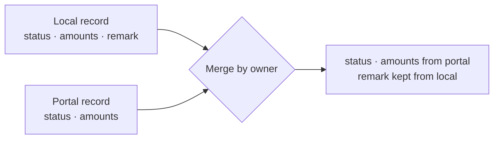

A GST compliance platform's Invoice Management System (IMS) syncs inward supplier invoices from the government's GST portal through a GSP partner API, reconciles them against the local purchase ledger, and lets CA firms accept or reject them in bulk. Two bugs in that sync had something in common: every request succeeded, and the data was still wrong.

## Failure one: `b2b` is not `B2B`

The portal expects the section parameter in uppercase: `section=B2B`. The system was sending `section=b2b`.

Nothing errored. The portal answered **HTTP 200 with an empty result set**, which is indistinguishable from "there is nothing to sync". The consequence was that credit note syncs were silently dropped — all of them.

The fix was to send the uppercase value. The interesting part is why the bug could exist at all.

### Why nothing caught it

An empty list is a legitimate answer. A client for this API has no way to tell "you asked a valid question and the answer is nothing" from "you asked a question I didn't understand, so here is nothing". The status code carries no information here; only the parameter does.

That means the defence has to be on our side of the wire:

```ts title="section.sketch.ts"
// The portal's section names, exactly as it expects them. Using a union instead
// of a free string makes the lowercase variant a compile error, not an empty 200.
export type GstSection = 'B2B' | 'CDNR' | 'B2BA' | 'CDNRA';

export function sectionParam(section: GstSection): string {
  return `section=${section}`;
}

sectionParam('B2B'); // ok
// sectionParam('b2b'); // Argument of type '"b2b"' is not assignable to parameter of type 'GstSection'.
```

*A sketch of the pattern, not the production code; the section list is illustrative.*

A type only helps where the value is written in code. Where it arrives from configuration or another service, the same idea becomes validation at the boundary: reject anything that isn't one of the known values before the request is sent.

## Failure two: the sync that erased remarks

The second bug was quieter. CA users type remarks — justifications for accepting or rejecting an invoice — and those remarks are sent to the portal. But the GSP partner API's update and read responses don't carry remarks back.

So on each sync, the system took the portal's version of a record, saw no remarks field, and wrote `null` over the remark the user had typed.

### The general shape

This is a field-ownership bug. A sync that replaces a local record with the remote one assumes the remote side owns every field. Here it didn't: the remark was ours, the portal just didn't echo it.



```ts title="merge.sketch.ts"
interface ImsRecord {
  status: string;
  taxableValue: string;
  remarks: string | null;
}

// Fields the portal is authoritative for. Anything else is locally owned and
// must survive a sync even when the portal response omits it.
const PORTAL_OWNED = ['status', 'taxableValue'] as const satisfies readonly (keyof ImsRecord)[];

export function mergeFromPortal(local: ImsRecord, remote: Partial<ImsRecord>): ImsRecord {
  const merged = { ...local };
  for (const field of PORTAL_OWNED) {
    if (remote[field] !== undefined) merged[field] = remote[field];
  }
  return merged;
}
```

*Again a sketch of the pattern. Field names are illustrative.*

## What the two bugs share

Both were integrations that reported success while losing data. A few habits would have surfaced them earlier, and are worth having on any third-party sync:

- **Treat "empty" as a signal worth looking at.** A sync that suddenly returns zero rows for a category that normally has some is more likely broken than quiet.
- **Pin request parameters to the provider's exact vocabulary**, including case, in one place.
- **Write down who owns each field** before writing the sync. If the answer is "both", the merge needs a rule, not an overwrite.
- **Test against recorded real responses**, not responses shaped the way you expect. The remarks bug only exists because the real response omits a field.

## What it taught

A 200 means the request was well-formed enough for the server to answer. It says nothing about whether you asked the question you meant to ask, or whether you understood the answer. In integrations with systems you don't control, correctness has to be checked on your side of the wire — because the other side will cheerfully tell you everything is fine.
