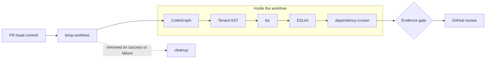

[Antigravity](/projects/antigravity-pr-reviewer) is a Rust daemon that reviews pull requests on a production NestJS codebase without being asked. It polls GitHub for PRs labelled `review-requested`, checks each one out, runs a five-pass static analysis pipeline, and posts a review with line-anchored comments.

A tool like that needs repository access to work. Its safety architecture answers one question: how to make sure that access can never turn into a change to the repository — not by being careful, but by construction.

## The problem

An automated reviewer runs unattended, processes PRs in parallel, and executes project tooling (`tsc`, ESLint, dependency-cruiser) inside the code it is reviewing. Two things can go wrong:

1. **State leaks.** Reviews share a checkout, and one review's state — a modified file, a switched branch, a leftover build artifact — contaminates another, or the main checkout.
2. **Mutation.** Some code path, now or after a future change, pushes, merges, or otherwise writes to the repository.

The first is an isolation problem. The second is a capability problem.

## Isolation: one worktree per PR

Every PR gets its own `git worktree` at the PR's head commit, in a temporary directory, separate from the main checkout. All five passes run there:



Worktrees are cleaned up after each review **regardless of whether the pipeline succeeds or fails**. In Rust, one way to make "regardless" structural rather than remembered is to tie the worktree's lifetime to a value:

```rust title="worktree.sketch.rs"
use std::path::{Path, PathBuf};
use std::process::Command;

pub struct Worktree {
    repo: PathBuf,
    path: PathBuf,
}

impl Worktree {
    pub fn create(repo: &Path, head_sha: &str) -> std::io::Result<Self> {
        let path = std::env::temp_dir().join(format!("review-{head_sha}"));
        let status = Command::new("git")
            .arg("-C")
            .arg(repo)
            .args(["worktree", "add", "--detach"])
            .arg(&path)
            .arg(head_sha)
            .status()?;
        if !status.success() {
            return Err(std::io::Error::other("git worktree add failed"));
        }
        Ok(Self { repo: repo.to_path_buf(), path })
    }

    pub fn path(&self) -> &Path {
        &self.path
    }
}

impl Drop for Worktree {
    // Runs on every exit path: success, early return, `?`, or panic unwinding.
    fn drop(&mut self) {
        let _ = Command::new("git")
            .arg("-C")
            .arg(&self.repo)
            .args(["worktree", "remove", "--force"])
            .arg(&self.path)
            .status();
    }
}
```

*A sketch of the technique rather than Antigravity's source.* `--detach` is a small but useful detail: the worktree has no branch checked out, so there is no local branch to accidentally push.

## Capability: prove the mutation paths don't exist

Isolation protects the main checkout from the review. It doesn't stop code from deliberately calling `git push`.

Antigravity handles that at the module boundary. All GitHub interaction lives in `src/github.rs`, and that file is **architecturally prohibited from containing any `git push`, `git merge` or repository-mutation code path**. The prohibition is enforced by unit tests that **parse the source AST and fail if those patterns appear**.

Parsing matters. A `grep` for "push" also matches comments and doc text; an AST check looks only at the method calls and string literals the compiler sees. A test in that spirit, using the `syn` crate (features `full` and `visit`):

```rust title="tests/no_mutation.sketch.rs"
use std::fs;
use syn::visit::{self, Visit};
use syn::{ExprMethodCall, LitStr};

const BANNED: &[&str] = &["push", "merge"];

#[derive(Default)]
struct Findings(Vec<String>);

impl<'ast> Visit<'ast> for Findings {
    fn visit_lit_str(&mut self, lit: &'ast LitStr) {
        let value = lit.value();
        if value.split_whitespace().any(|word| BANNED.contains(&word)) {
            self.0.push(format!("string literal {value:?}"));
        }
    }

    fn visit_expr_method_call(&mut self, call: &'ast ExprMethodCall) {
        let name = call.method.to_string();
        if BANNED.contains(&name.as_str()) {
            self.0.push(format!("method call .{name}()"));
        }
        visit::visit_expr_method_call(self, call);
    }
}

#[test]
fn github_module_has_no_mutation_paths() {
    let source = fs::read_to_string("src/github.rs").expect("read src/github.rs");
    let file = syn::parse_file(&source).expect("parse src/github.rs");
    let mut findings = Findings::default();
    findings.visit_file(&file);
    assert!(
        findings.0.is_empty(),
        "src/github.rs must not mutate the repository: {:?}",
        findings.0
    );
}
```

*Illustrative. Antigravity's own tests encode its specific list of prohibited patterns.*

The value of this isn't that today's code is safe — a reviewer could check that by reading it. It's that **tomorrow's** code can't quietly become unsafe. A future change that adds a push path fails CI before it can merge.

## Keeping the output worth reading

Safety is half the design; the other half is not being noise. A finding only becomes a comment if it passes the **evidence gate**: it must be anchored to a specific line in a changed file, not a general pattern match. Surviving findings are pinned to exact diff lines through the GitHub Pull Request Review API, and the bot submits a full review — `REQUEST_CHANGES` or `APPROVE` — based on aggregate severity.

## What it taught

"The bot is careful" is a statement about behaviour, and behaviour changes with every commit. "The module that talks to GitHub cannot contain a push" is a statement about structure, and a test can hold it in place. For automation with access to things that matter, the second kind of guarantee is the one worth building.
