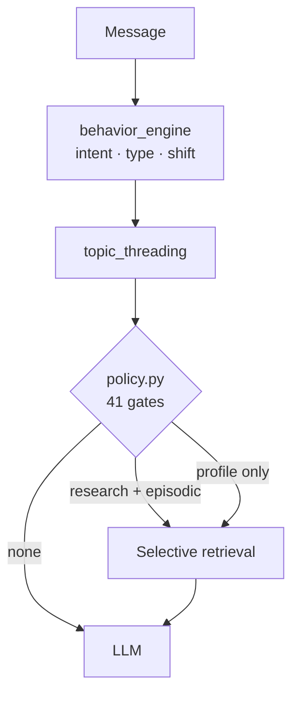

Most retrieval-augmented generation systems retrieve on every turn. A message arrives, it is embedded, the nearest chunks are fetched, and they go into the prompt. Memory, in that design, is a sliding window plus whatever the vector search returns.

[BARA](/projects/bara) — Behavior-Adaptive Retrieval Architecture — is a research prototype built around a different assumption: that *whether* to retrieve, and *from where*, is a decision that should be made explicitly, before any retrieval happens.

## The problem with always retrieving

Always-on retrieval treats every message as a question about the knowledge base. Conversations aren't like that. A turn might be an acknowledgement, a correction of the previous answer, a follow-up on something decided three sessions ago, or a genuinely new question. Each wants a different kind of context — and some want none.

When retrieval runs regardless, the prompt fills with context chosen by similarity rather than need. The question BARA is built to answer is whether a structured alternative measurably does better:

> Can a structured, multi-tier memory architecture with deterministic retrieval gating outperform standard sliding-window RAG in multi-turn conversations?

## Four kinds of memory

Instead of one vector store, BARA keeps four tiers with different lifetimes:

| Tier | Lifetime | What it holds |
| --- | --- | --- |
| Research memory | Permanent, cross-thread | Decisions, conclusions and hypotheses, linked in a concept graph |
| Conversational state | Per conversation | Tone, precision mode, repetition patterns, active topic threads |
| Semantic profile | Permanent, per user | Identity, preferences, expertise domains |
| Episodic memory | Permanent | Past interactions with pgvector embeddings |

Separating them matters because they answer different questions. "What did we decide about this?" is a research-memory question. "How technical should this answer be?" is a profile question. Neither is well served by nearest-neighbour search over a single pool of chunks.

## Deciding before retrieving



Each message passes through two classifiers before retrieval is considered:

- `behavior_engine.py` classifies intent, conversation type and behavioural shift.
- `topic_threading.py` tracks active topic threads across turns and detects when the topic changes or refers back.

Only then does `policy.py` decide. It is **41 deterministic decision gates with 50+ tunable thresholds**. A gate is a plain rule over the classifiers' outputs and the conversation state; it either opens a tier or doesn't.

A gate has roughly this shape:

```python title="gate.sketch.py"
from dataclasses import dataclass


@dataclass(frozen=True)
class Signals:
    intent: str            # from behavior_engine
    refers_back: bool      # from topic_threading
    topic_shift: float     # 0..1


@dataclass(frozen=True)
class Thresholds:
    topic_shift_for_research: float = 0.6


def research_memory_gate(s: Signals, t: Thresholds) -> bool:
    """Open research memory only when the user points back at earlier work,
    or the topic has moved far enough that prior conclusions may apply."""
    if s.intent == "acknowledgement":
        return False
    return s.refers_back or s.topic_shift >= t.topic_shift_for_research


print(research_memory_gate(Signals("question", refers_back=True, topic_shift=0.1), Thresholds()))  # True
print(research_memory_gate(Signals("acknowledgement", refers_back=True, topic_shift=0.9), Thresholds()))  # False
```

*An illustrative gate, not one of the 41 in `policy.py`. The point is the form: named inputs, a named threshold, a boolean you can log.*

### Why deterministic

A learned router might make similar decisions, but its reasons would be much harder to inspect. With explicit gates, every decision has a name and a threshold, which means it can be inspected, tuned and tested in isolation. That is what makes the next two pieces possible.

## Making decisions visible

BARA's React frontend shows a **real-time pipeline timeline for every request**: which gates fired, which memory tier was hit, and what was retrieved. A CLI (`cli.py`) inspects and queries the stored cognitive state between sessions.

Without this, tuning 50+ thresholds would be guesswork. With it, a bad answer can be traced to a specific gate that opened or stayed closed.

## Testing it

The system is set up to answer its research question rather than assert the answer:

- An **A/B experiment framework** runs BARA against standard RAG over a **5,000+ chunk knowledge base** — 52 complete IETF RFCs plus 14 technical documents.
- A **50-query evaluation suite** covers diverse queries, scored with **LLM-as-a-Judge** relevance scoring.
- **358 automated tests** cover each subsystem independently.

I'm deliberately not quoting comparison results here. The harness and corpus are in the [repository](https://github.com/Kesh3805/Layered-Memory-Architecture); when results are written up, they'll be written up with the setup they came from.

## What it taught

Retrieval is a cost, not a default: it spends context, adds latency and can drag in things the user didn't ask about. Treating it as a decision — made by rules you can read, with outputs you can see — turns "the model gave a strange answer" from a mystery into a trace.
