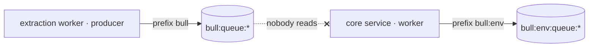

import QueueIdentityExplainer from '../../apps/web/src/components/explainers/QueueIdentityExplainer.astro';


The GST compliance platform has two services involved in reading invoices. The **Document Extraction & Ingestion Worker** takes an uploaded PDF, sends it to LlamaIndex Cloud for extraction, and receives the result through a signed webhook. It then hands the result to the **Core Domain & Ledger Service**, which maps it into the ledger. The hand-off is a BullMQ queue on Redis.

For a while, that hand-off delivered nothing. It was a cross-repo P0.

## The problem

Both services agreed on the queue's **name**. They did not agree on its **keyspace**.

- The extraction worker produced jobs using BullMQ's default prefix, so its keys lived under `bull:`.
- The core service consumed from an environment-namespaced prefix, `bull:<env>:`.

Same queue name, different keyspace. Every OCR extraction result was enqueued successfully — into a set of keys that no worker was listening to.



## Why it was hard to see

Every component, inspected on its own, looked healthy:

- The producer's `add()` calls resolved. From the producer's point of view, jobs were enqueued.
- The worker was connected and idle. From the API's point of view, the queue was empty — which is what an up-to-date queue looks like.
- Both services talked to the same Redis, so nothing looked misconfigured at the connection level.

A queue name looks like an address. In BullMQ it's only part of one. The key a job lives under is `prefix` + queue name, and the prefix is configured separately — often by default, which means by omission.

If you suspect this class of problem, Redis will show it directly: scanning for the queue name across prefixes shows jobs piling up under one prefix while the other stays empty.

```bash
redis-cli --scan --pattern 'bull:*' | cut -d: -f1-3 | sort | uniq -c
```

## The fix, and the pattern behind it

The fix aligned producer and consumer on one keyspace. The way to keep it from coming back is to stop letting each service spell the queue's location on its own.

<QueueIdentityExplainer />

```ts title="queues.sketch.ts"
import { Queue, Worker, type ConnectionOptions, type Processor } from 'bullmq';

// One definition of where a queue lives, shared by producer and consumer.
// The prefix is part of the queue's identity, not a per-service setting.
export function queueLocation(env: string) {
  return { prefix: `bull:${env}` } as const;
}

export function producer(name: string, env: string, connection: ConnectionOptions) {
  return new Queue(name, { connection, ...queueLocation(env) });
}

export function consumer(name: string, env: string, connection: ConnectionOptions, work: Processor) {
  return new Worker(name, work, { connection, ...queueLocation(env) });
}
```

*A sketch of the pattern. Where two services live in two repositories, the same idea can be a small shared package or a single documented convention with a test on each side.*

## The same bug, one layer over

The same class of mismatch showed up in sessions. The core service stored sessions under an `<app>:<env>:session` convention. The extraction worker read sessions under a different key shape, so in shared Redis instances its auth lookups missed. Namespacing the worker's session keys to the same convention fixed it.

Two bugs, one lesson: in a shared Redis, **the key layout is an interface between services**, as much as an HTTP route is. It just doesn't come with a schema, a client library or an error when you get it wrong.

## What changed

- Producer and consumer share one keyspace, and extraction results reach the API worker.
- Worker session keys follow the same environment-namespaced convention as the core service.

## What it taught

"Enqueued successfully" and "delivered" are different claims, and only the second one matters. When a pipeline stage looks idle, check that it is listening in the same place the previous stage is writing — before checking whether the previous stage is writing at all.
