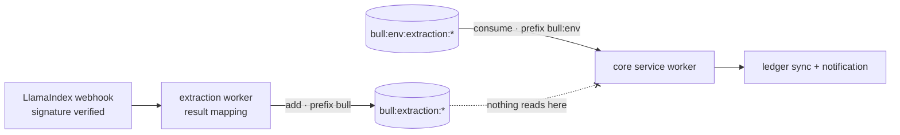

import QueueIdentityExplainer from '../../apps/web/src/components/explainers/QueueIdentityExplainer.astro';

**Severity:** P0, cross-repository. **Component:** hand-off between the document extraction worker and the core domain service. **Class:** configuration drift in a shared Redis keyspace.

> The code in this write-up is written for it and simplified; it is not the employer's source.

## Summary

Invoice extraction results were produced, enqueued and never consumed. The extraction worker wrote BullMQ jobs under Redis's default `bull:` key prefix; the core service's worker consumed the same queue name under an environment-namespaced `bull:<env>:` prefix. Both sides were healthy by every measure they reported. None of the results reached the ledger.

## Impact

The extraction pipeline runs: file upload → object storage → LlamaIndex Cloud → signed webhook back to the extraction worker → result mapping → **BullMQ** → core service → ledger. Everything up to and including the enqueue worked. Everything after it didn't happen:

- extracted invoices never landed in the purchase ledger;
- the durable notification that tells a reviewer their upload is ready — emitted at the end of that path — never fired;
- the webhook had been handled and the job accepted, so nothing upstream had a reason to retry.



## Root cause

In BullMQ, a queue is identified by **prefix + name**, not by name. Every key the queue uses is built as `{prefix}:{name}:…`, and `prefix` defaults to `bull` when it isn't configured.

The two services live in different repositories and configured BullMQ independently. The core service set an environment-namespaced prefix; the extraction worker never set one and got the default. They agreed on the queue name — the part that looks like an address — and disagreed on the part that actually is one.

## Why every signal was green

- **Producer:** `queue.add()` resolved. A resolved `add` means Redis accepted the job; it says nothing about whether any worker will ever see it.
- **Consumer:** the worker was connected and idle. An idle worker on an empty queue is exactly what a *caught-up* system looks like.
- **Infrastructure:** both services pointed at the same Redis instance, so connection checks, latency and memory all looked normal.
- **Upstream:** from the extraction provider's side, the result had been delivered and handled.

Each component's health was local. The failure only existed in the relationship between two configurations.

## Seeing it in Redis

The fastest confirmation is to look at which prefixes actually hold keys for the queue name. BullMQ's layout is regular enough to read directly:

| Key | Type | What it holds |
| --- | --- | --- |
| `{prefix}:{queue}:wait` | list | job IDs waiting for a worker |
| `{prefix}:{queue}:active` | list | job IDs a worker has taken |
| `{prefix}:{queue}:delayed` | sorted set | jobs scheduled for later, scored by timestamp |
| `{prefix}:{queue}:completed` / `:failed` | sorted sets | finished jobs, until removed |
| `{prefix}:{queue}:id` | string | the job ID counter |
| `{prefix}:{queue}:{jobId}` | hash | one job's data, options and progress |
| `{prefix}:{queue}:events` | stream | the queue's event log |

Grouping keys by their first segments shows the split immediately — one prefix with a growing `wait` list and job hashes, the other with nothing:

```bash
redis-cli --scan --pattern '*extraction*' \
  | awk -F: '{ print $1 ":" $2 ":" $3 }' | sort | uniq -c | sort -rn

# and the length of each candidate wait list
redis-cli LLEN 'bull:extraction:wait'
redis-cli LLEN "bull:${ENV}:extraction:wait"
```

Use `SCAN` rather than `KEYS` on anything shared; `KEYS` blocks the server while it walks the whole keyspace.

## Fix

Producer and consumer were aligned on one keyspace, and the prefix stopped being something each service spells for itself. The queue's full identity — prefix, name and the job options both sides assume — lives in one definition:

```ts title="extraction-queue.contract.ts"
import type { DefaultJobOptions } from 'bullmq';

/** Everything that makes this queue *this* queue. Producer and consumer import it;
 *  neither passes a prefix or a name of its own. */
export const extractionQueue = (env: string) =>
  ({
    name: 'extraction',
    prefix: `bull:${env}`,
    defaultJobOptions: {
      attempts: 5,
      backoff: { type: 'exponential', delay: 2_000 },
      removeOnComplete: { age: 24 * 3600 },
      removeOnFail: false,
    } satisfies DefaultJobOptions,
  }) as const;
```

```ts title="queues.module.ts"
import { BullModule } from '@nestjs/bullmq';
import { Module } from '@nestjs/common';
import { ConfigService } from '@nestjs/config';
import { extractionQueue } from './extraction-queue.contract';

@Module({
  imports: [
    BullModule.registerQueueAsync({
      name: 'extraction',
      inject: [ConfigService],
      useFactory: (config: ConfigService) => {
        const { prefix, defaultJobOptions } = extractionQueue(config.getOrThrow('APP_ENV'));
        return {
          prefix,
          defaultJobOptions,
          connection: { url: config.getOrThrow('REDIS_URL') },
        };
      },
    }),
  ],
  exports: [BullModule],
})
export class QueuesModule {}
```

Where the two services can't share a package, the same contract can be a documented constant with a test on each side asserting the resolved prefix — the point is that both sides derive the key from the same inputs rather than from separate defaults.

<QueueIdentityExplainer />

## The same mistake, one layer over

Sessions had the same shape. The core service stored sessions under an `<app>:<env>:session` convention; the extraction worker looked them up under a different key shape. In a Redis instance shared across environments, the worker's auth lookups missed. Its session keys were namespaced to the core service's convention.

Two different features, one underlying fact: in a shared Redis, **the key layout is an interface between services**. It has no schema, no client library that enforces it, and no error when two sides disagree — so it needs to be written down in exactly one place, like any other contract.

## Guards worth having

These are the checks that would have turned this from a silent failure into a loud one:

- **Log the resolved key prefix at startup**, for every `Queue` and `Worker`. A one-line difference between two services' boot logs is easier to spot than an empty queue.
- **Alert on age, not just depth.** A `wait` list that only grows, or a completed count that stays at zero while producers report successful adds, is a stronger signal than any single gauge.
- **Test the hand-off end to end**, with both services' real configuration, not with each side mocked against its own assumptions.
